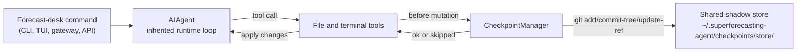

# Checkpoints and `/rollback`

Superforecasting Agent can snapshot a project workspace before risky file or terminal operations and restore that workspace with `/rollback`. This protects source adapters, data notebooks, benchmark scripts, and local research artifacts. It does **not** replace the forecast ledger: forecasts, evidence, resolutions, scores, postmortems, and calibration lessons should remain in the append-only ledger.

Checkpoints are opt-in because the shadow store can grow over time.

Enable checkpoints for one session:

```bash
superforecasting-agent chat --checkpoints
```

Or enable them globally in `~/.superforecasting-agent/config.yaml`:

```yaml
checkpoints:
  enabled: true
```

Legacy `~/.hermes/config.yaml` remains readable during migration.

## What Triggers a Checkpoint

Checkpoints are taken automatically before:

- file tools such as `write_file` and `patch`
- destructive terminal commands such as `rm`, `rmdir`, `cp`, `install`, `mv`, `sed -i`, `truncate`, `dd`, `shred`, output redirects, and `git reset`/`clean`/`checkout`

The runtime creates at most one checkpoint per directory per turn.

## Quick Reference

In-session slash commands:

| Command | Description |
|---------|-------------|
| `/rollback` | List all checkpoints with change stats |
| `/rollback <N>` | Restore to checkpoint N and undo the last chat turn |
| `/rollback diff <N>` | Preview diff between checkpoint N and current state |
| `/rollback <N> <file>` | Restore a single file from checkpoint N |

CLI management:

| Command | Description |
|---------|-------------|
| `superforecasting-agent checkpoints` | Show total size, project count, and per-project breakdown |
| `superforecasting-agent checkpoints status` | Same as bare `checkpoints` |
| `superforecasting-agent checkpoints list` | Alias for `status` |
| `superforecasting-agent checkpoints prune` | Delete orphaned/stale entries, run GC, and enforce size caps |
| `superforecasting-agent checkpoints clear` | Delete the entire checkpoint base after confirmation |
| `superforecasting-agent checkpoints clear-legacy` | Delete only `legacy-*` archives from pre-v2 migration |

The inherited `hermes checkpoints ...` command remains a compatibility alias where installed.

## How Checkpoints Work

The Checkpoint Manager keeps a single shared shadow git repository under the active agent home, normally `~/.superforecasting-agent/checkpoints/store/`. Your real project `.git` is never touched.



For each project root, the manager stages files into a per-project index, builds a tree, and commits it to a per-project ref. Git object deduplication keeps repeated snapshots smaller than full directory copies.

## Configuration

Configure checkpoint behavior in `~/.superforecasting-agent/config.yaml`:

```yaml
checkpoints:
  enabled: false
  max_snapshots: 20
  max_total_size_mb: 500
  max_file_size_mb: 10
  auto_prune: true
  retention_days: 7
  delete_orphans: true
  min_interval_hours: 24
```

When `enabled: false`, the Checkpoint Manager is a no-op. When `auto_prune: false`, the store grows until you run `superforecasting-agent checkpoints prune`.

## Listing Checkpoints

From an interactive session:

```text
/rollback
```

Example output:

```text
Checkpoints for /path/to/project:

  1. 4270a8c  2026-03-16 04:36  before patch  (1 file, +1/-0)
  2. eaf4c1f  2026-03-16 04:35  before write_file
  3. b3f9d2e  2026-03-16 04:34  before terminal: sed -i s/old/new/ config.py  (1 file, +1/-1)

  /rollback <N>             restore to checkpoint N
  /rollback diff <N>        preview changes since checkpoint N
  /rollback <N> <file>      restore a single file from checkpoint N
```

From the shell:

```bash
superforecasting-agent checkpoints
```

Example output:

```text
Checkpoint base: /home/you/.superforecasting-agent/checkpoints
Total size:      142.3 MB
  store/         138.1 MB
  legacy-*       4.2 MB
Projects:        12

  WORKDIR                                                       COMMITS    LAST TOUCH  STATE
  /home/you/code/superforecasting-agent                              20       2h ago  live
  /home/you/code/forecast-data-pipelines                              8       1d ago  live
  /home/you/code/old-benchmark-prototype                              3       9d ago  orphan

Legacy archives (1):
  legacy-20260506-050616                           4.2 MB

Clear with: superforecasting-agent checkpoints clear-legacy
```

Force a sweep:

```bash
superforecasting-agent checkpoints prune --retention-days 3 --max-size-mb 200
```

## Previewing and Restoring

Preview changes before restoring:

```text
/rollback diff 1
```

Restore a full checkpoint:

```text
/rollback 1
```

The runtime verifies the target commit, saves a pre-rollback snapshot, restores tracked files, and undoes the last forecast-support turn so the active context matches the restored filesystem state.

Restore one file:

```text
/rollback 1 src/broken_source_adapter.py
```

Single-file restore is useful when a source parser or benchmark script regressed but the rest of the workspace should stay as-is.

## Safety and Performance Guards

- **Git availability** — if `git` is missing, checkpoints are disabled.
- **Directory scope** — root `/` and home `$HOME` are skipped.
- **Repository size** — directories with more than 50,000 files are skipped.
- **Per-file size cap** — large files are excluded to avoid snapshotting datasets, model weights, browser caches, generated media, or source snapshots.
- **Total store size cap** — the oldest commit per project is dropped round-robin when the store exceeds the configured cap.
- **No-change snapshots** — snapshots are skipped when there are no file changes.
- **Non-fatal errors** — checkpoint failures are logged and tool execution continues.

## Where Checkpoints Live

```text
~/.superforecasting-agent/checkpoints/
  ├── store/                    # shared bare git repo
  │   ├── HEAD, objects/        # git internals
  │   ├── refs/hermes/<hash>    # inherited per-project ref namespace
  │   ├── indexes/<hash>        # per-project git index
  │   ├── projects/<hash>.json  # workdir + created_at + last_touch
  │   └── info/exclude
  ├── .last_prune
  └── legacy-<ts>/              # archived pre-v2 per-project shadow repos
```

The `refs/hermes/` namespace is an inherited git ref name. New user-facing paths should still use the active Superforecasting Agent home.

## Migration from v1

Before the v2 checkpoint rewrite, each working directory had its own complete shadow git repository directly under `~/.hermes/checkpoints/<hash>/`. On first v2 run, those repos are moved into `~/.superforecasting-agent/checkpoints/legacy-<timestamp>/` when the fork-native home is active. Migrated legacy homes may keep the archive under `~/.hermes/checkpoints/legacy-<timestamp>/`.

Once you no longer need old `/rollback` history:

```bash
superforecasting-agent checkpoints clear-legacy
```

## Best Practices

- Enable checkpoints only for sessions that may edit files or run destructive local commands.
- Use `/rollback diff` before restoring.
- Use `/rollback` instead of `git reset` when you want to undo agent-driven workspace changes without touching your repo history.
- Keep forecast ledger state append-only; do not rely on filesystem rollback to erase forecasts, scores, or postmortems.
- Check `superforecasting-agent checkpoints status` if you use checkpoints regularly.
- Use Git worktrees for parallel agent work on the same repo.

For parallel repository work, see [Git worktrees](./git-worktrees.md).
